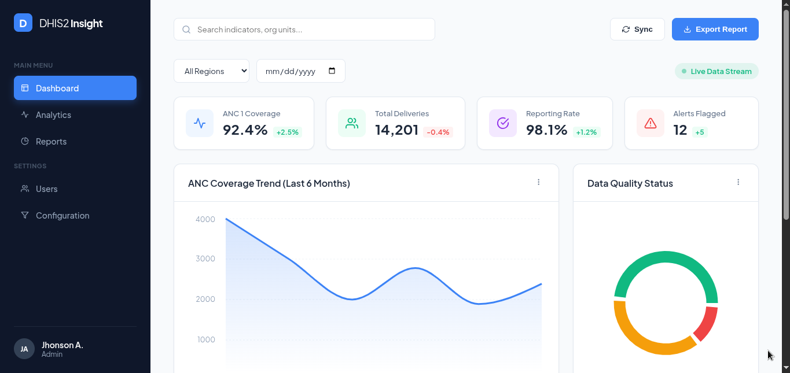

# 🏥 DHIS2 Maternal Health Analytics Dashboard


A professional, high-performance analytics dashboard designed for monitoring National Maternal Health indicators. This application integrates with the DHIS2 API to visualize ANC (Antenatal Care) coverage, delivery rates, and data quality metrics in real-time.



## 🚀 Key Features

* **📊 Hybrid Data Engine:** Automatically switches between **Live DHIS2 API data** and **Offline Mock Data** if the connection is unstable.
* **🎨 Advanced Visualization:** Uses `Recharts` for interactive Area charts, Composed Bar charts, and Pie charts.
* **💎 Modern UI/UX:** Built with a "Glassmorphism" aesthetic, featuring subtle gradients, shadows, and a clean layout.
* **🔍 Interactive Filtering:** Filter data by **Region** (Addis Ababa, Oromia, etc.) and Time Period.
* **📱 Fully Responsive:** Optimized for both desktop control rooms and mobile field tablets.

## 🛠️ Tech Stack

* **Frontend:** React.js (Vite)
* **Charting:** Recharts
* **Styling:** CSS3 (Variables, Flexbox, Grid)
* **Icons:** React Icons (Feather)
* **Data Fetching:** Axios

## 📂 Project Structure

```bash
src/
├── components/
│   ├── StatCard.jsx       # Reusable top-level metric cards
│   ├── ChartWrapper.jsx   # Container for charts with headers
│   └── DataTable.jsx      # Recent facility report table
├── App.jsx                # Main dashboard logic & layout
├── App.css                # Global styles & variables
└── main.jsx               # Entry point
